# Image-Segmentation-Brain-Tumor (Updated: 2023/05/21)
<h2>
1 Image-Segmentation-Brain-Tumor
</h2>

This is an experimental project for Image-Segmentation of Brain-Tumor by using
our <a href="https://github.com/atlan-antillia/Tensorflow-Slightly-Flexible-UNet">Tensorflow-Slightly-Flexible-UNet</a> Model.
 

The image dataset used here has been taken from the following web site.

<pre>
Brain MRI segmentation
https://www.kaggle.com/datasets/mateuszbuda/lgg-mri-segmentation
</pre>

About Dataset 
LGG Segmentation Dataset 
Dataset used in: 

Mateusz Buda, AshirbaniSaha, Maciej A. Mazurowski "Association of genomic subtypes of 
lower-grade gliomas with shape features automatically extracted by a deep learning 
algorithm." Computers in Biology and Medicine, 2019.
and
Maciej A. Mazurowski, Kal Clark, Nicholas M. Czarnek, Parisa Shamsesfandabadi, 
Katherine B. Peters, Ashirbani Saha "Radiogenomics of lower-grade glioma: 
algorithmically-assessed tumor shape is associated with tumor genomic subtypes 
and patient outcomes in a multi-institutional study with 
The Cancer Genome Atlas data." Journal of Neuro-Oncology, 2017.

This dataset contains brain MR images together with manual FLAIR abnormality 
segmentation masks.
The images were obtained from The Cancer Imaging Archive (TCIA).
They correspond to 110 patients included in The Cancer Genome Atlas (TCGA) 
lower-grade glioma collection with at least fluid-attenuated inversion recovery (FLAIR) 
sequence and genomic cluster data available.
Tumor genomic clusters and patient data is provided in data.csv file.

See also:

<pre>
U-Net: Convolutional Networks for Biomedical Image Segmentation
 https://arxiv.org/pdf/1505.04597.pdf
</pre>
<ul>
    <li>2023/05/12: Modified TensorflowUNetModel to be compiled with basnet_hybrid_loss function. </li>
    <li>2023/05/12: Trained, evaluated and inferred Brain-Tumor-TensorflowUNet-Model with basnet_hybrid_loss. </li>
    <li>2023/05/21: Modified to read and eval <b>loss</b> and <b>metrics</b> functions from a configuration file. 
</li>
</ul>

 
<h2>
2 Prepare dataset
</h2>

<h3>
2.1 Download master dataset
</h3>
 Please download the original dataset from the following link 
<pre>
https://www.kaggle.com/datasets/mateuszbuda/lgg-mri-segmentation
</pre>
<b>lgg-mri-segmentation</b> dataset has the following folder structure. 
<pre>
lgg-mri-segmentation
└─kaggle_3m
    ├─TCGA_CS_4941_19960909
    ├─TCGA_CS_4942_19970222
    ├─TCGA_CS_4943_20000902
    ├─TCGA_CS_4944_20010208
    ├─TCGA_CS_5393_19990606
     ...
    ├─TCGA_HT_A5RC_19990831
    ├─TCGA_HT_A616_19991226
    ├─TCGA_HT_A61A_20000127
    └─TCGA_HT_A61B_19991127
</pre>
For example,TCGA_CS_4941_19960909 folder contains the MRI image files and corressponding mask files
as show below. 
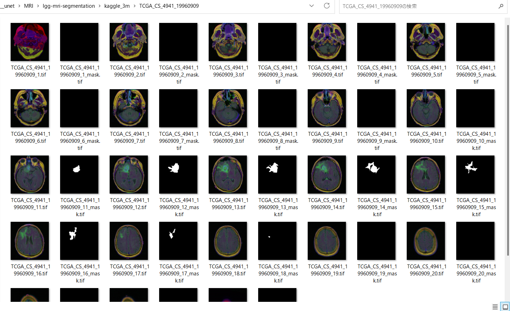 

<h3>
2.2 Split master dataset
</h3>
We have split Brain-Tumor dataset to <b>train</b> and <b>test</b> dataset 
by using Python <a href="./split_master.py">split_master.py</a> script.
<pre>
BrainTumor
├─test
│  ├─image
│  └─mask
└─train
    ├─image
    └─mask
</pre>

<h2>
3 Train TensorflowUNet Model
</h2>
 We have trained Brain-Tumor TensorflowUNet Model by using the following
 <b>train_eval_infer.config</b> file.  
Please run the following bat file. 
<pre>
>1.train.bat
</pre>
, which simply runs the following command. 
<pre>
>python TensorflowUNetBrainTumorTrainer.py
</pre>

<pre>
; train_eval_infer.config
; 2023/5/20 antillia.com
; Modified to use loss and metric
; Specify loss as a function nams
; loss =  "binary_crossentropy"
; Specify metrics as a list of function name
; metrics = ["binary_accuracy"]
; Please see: https://www.tensorflow.org/api_docs/python/tf/keras/Model?version=stable#compile

[model]
image_width    = 256
image_height   = 256
image_channels = 3
num_classes    = 1
base_filters   = 16
num_layers     = 6
dropout_rate   = 0.08
learning_rate  = 0.001

loss           = "binary_crossentropy"
metrics        = ["binary_accuracy"]
show_summary   = False

[train]
epochs        = 100
batch_size    = 4
patience      = 10
metrics       = ["binary_accuracy", "val_binary_accuracy"]

model_dir     = "./models"
eval_dir      = "./eval"

image_datapath = "./BrainTumor/train/image/"
mask_datapath  = "./BrainTumor/train/mask/"

[eval]
image_datapath = "./BrainTumor/test/image/"
mask_datapath  = "./BrainTumor/test/mask/"

[infer] 
images_dir    = "./mini_test" 
output_dir    = "./mini_test_output"
</pre>

Since <pre>loss = "binary_crossentropy"</pre> and <pre>metrics = ["binary_accuracy"] </pre> are specified 
in <b>train_eval_infer.config</b> file,
<b>binary_crossentropy</b> and <b>binary_accuracy</b> functions are used to compile our model as shown below.
<pre>
    # Read a loss function name from a config file, and eval it.
    # loss = "binary_crossentropy"
    self.loss  = eval(self.config.get(MODEL, "loss"))

    # Read a list of metrics function names from a config file, and eval each of the list,
    # metrics = ["binary_accuracy"]
    metrics  = self.config.get(MODEL, "metrics")
    self.metrics = []
    for metric in metrics:
      self.metrics.append(eval(metric))
        
    self.model.compile(optimizer = self.optimizer, loss= self.loss, metrics = self.metrics)
</pre>
You can also specify other loss and metrics functions in the config file. 
Example: basnet_hybrid_loss(https://arxiv.org/pdf/2101.04704.pdf) 
<pre>
loss         = "basnet_hybrid_loss"
metrics      = ["dice_coef", "sensitivity", "specificity"]
</pre>
On detail of these functions, please refer to <a href="./losses.py">losses.py</a> , and 
<a href="https://github.com/shruti-jadon/Semantic-Segmentation-Loss-Functions/tree/master">Semantic-Segmentation-Loss-Functions (SemSegLoss)</a>.

We have also used Python <a href="./BrainTumorDataset.py">BrainTumorDataset.py</a> script to create
train and test dataset from the original and segmented images specified by
<b>image_datapath</b> and <b>mask_datapath </b> parameters in the configratration file. 
The training process has just been stopped at epoch 27 by an early-stopping callback as shown below.  
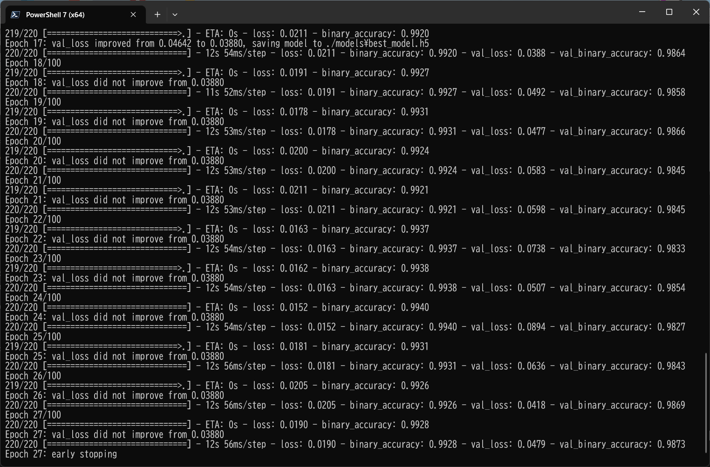 
 
The <b>val_accuracy</b> is very high as shown below from the beginning of the training. 
<b>Train accuracies line graph</b>: 
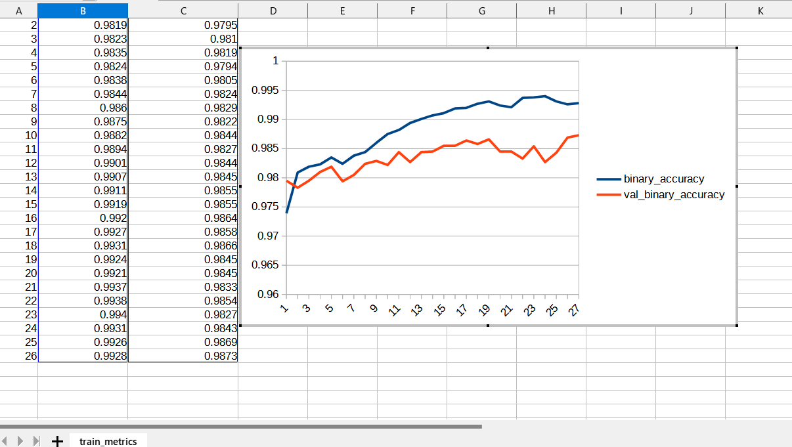 

 
The val_loss is also very low as shown below from the beginning of the training. 
<b>Train losses line graph</b>: 
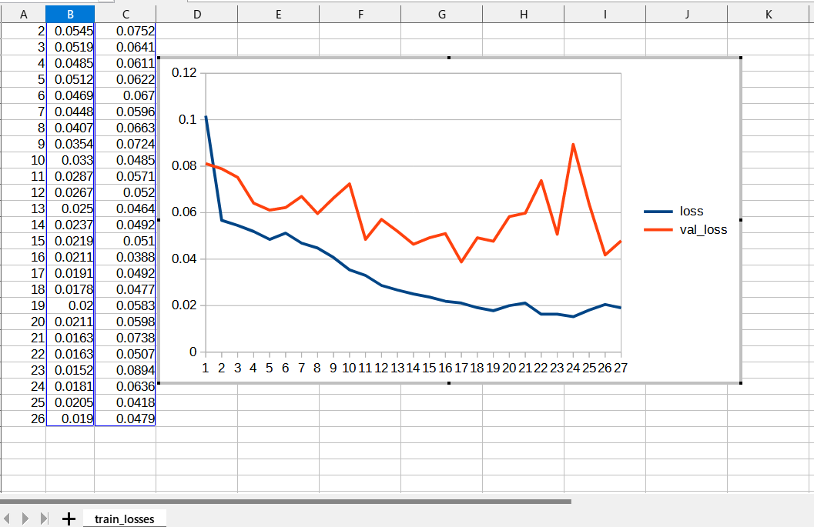 

<h2>
4 Evaluation
</h2>
 We have evaluated prediction accuracy of our Pretrained Brain-Tumor Model by using <b>test</b> dataset.
Please run the following bat file. 
<pre>
>2.evalute.bat
</pre>
, which simply run the following command. 
<pre>
>python TensorflowUNetBrainTumorEvaluator.py
</pre>
The evaluation result of this time is the following. 
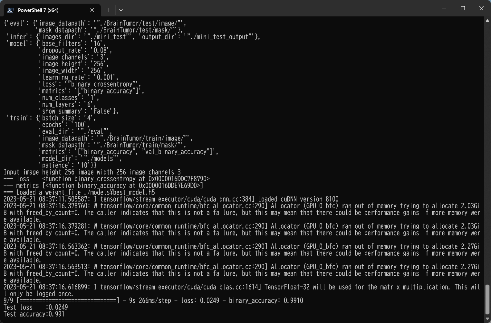 
 

<h2>
5 Inference 
</h2>
We have also tried to infer the segmented region for <b>mini_test</b> dataset, which is a very small dataset including only ten images extracted from <b>test</b> dataset,
 by using our Pretrained Brain-Tumor Model. 
<pre>
>3.infer.bat
</pre>
, which simply runs the following command. 
<pre>
>python TensorflowUNetBrainTumorInfer.py
</pre>

<b>Input images (mini_test) </b> 
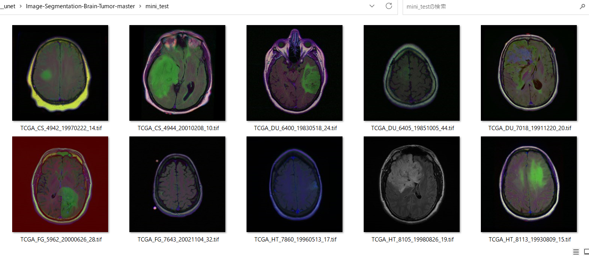 
 
<b>Infered images (mini_test_output)</b> 
Some green tumor regions in the original images of the mini_test dataset above have been detected as shown below.
  

 
<!--
-->

<h2>
6 Train TensorflowUNet Model with basnet_hybrid_loss
</h2>
We have updated the functions to compute losses in <a href="./losses.py">losses.py</a>, based on 
class <b>Semantic_loss_functions</b> in the web site <a href="https://github.com/shruti-jadon/Semantic-Segmentation-Loss-Functions">
Semantic-Segmentation-Loss-Functions (SemSegLoss)
</a>

 We have trained Brain-Tumor TensorflowUNet Model by using the following
 <b>train_eval_infer_basnet_hybrid_loss.config</b> file.  
Please run the following bat file. 
<pre>
>4.train.bat
</pre>
, which simply runs the following command. 
<pre> 
python ./TensorflowUNetBrainTumorTrainer.py ./train_eval_infer_basnet_hybrid_loss.config
</pre>
<pre>
; train_eval_infer_basnet_hybrid_loss.config
; 2023/5/20 antillia.com

[model]
image_width    = 256
image_height   = 256
image_channels = 3
num_classes    = 1
base_filters   = 16
num_layers     = 6
dropout_rate   = 0.08
learning_rate  = 0.001
loss           = "basnet_hybrid_loss"
metrics        = ["dice_coef", "sensitivity", "specificity"]
show_summary   = False

[train]
epochs        = 100
batch_size    = 4
patience      = 10
metrics       = ["dice_coef", "val_dice_coef"]
model_dir     = "./basnet_models"
eval_dir      = "./basnet_eval"
image_datapath = "./BrainTumor/train/image/"
mask_datapath  = "./BrainTumor/train/mask/"

[eval]
image_datapath = "./BrainTumor/test/image/"
mask_datapath  = "./BrainTumor/test/mask/"

[infer] 
images_dir     = "./mini_test" 
output_dir     = "./basnet_mini_test_output"
</pre>

Since <pre>loss = "basnet_hybrid_loss"</pre> and <pre>metrics= ["dice_coef", "val_dice_coef"]</pre>
are  in this configration file,
the following loss and metrics functions are used to compile our model as shown below.
<pre>
  self.loss    = basnet_hybrid_loss
  self.metrics = [dice_coef, sensitivity, specificity]
  self.model.compile(optimizer = self.optimizer, loss= self.loss, metrics = self.metrics)
</pre>

The training process has just been stopped at epoch 29 by an early-stopping callback as shown below.  
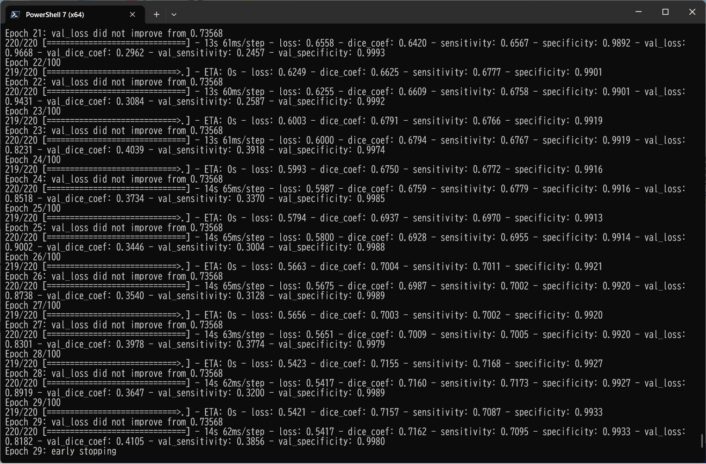 
 
<b>Train metrics (dice_coef) line graph</b>: 
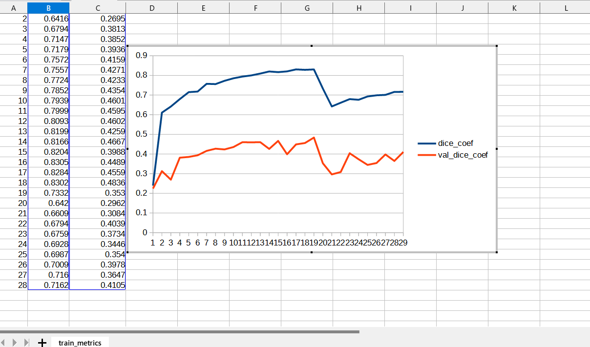 

 
<b>Train losses (basnet_hybrid_loss)line graph</b>: 
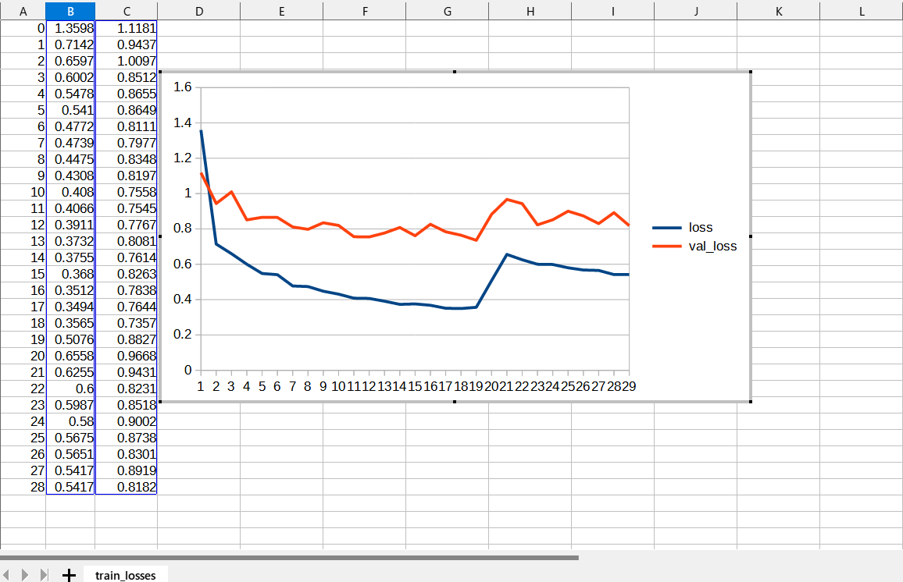 

<h2>
7 Evaluation by TensorflowUNet Model with basnet_hybrid_loss
</h2>
 We have evaluated prediction accuracy of our Pretrained Brain-Tumor Model by using <b>test</b> dataset. 
Please run the following bat file. 
<pre>
>5.train.bat
</pre>
, which simply runs the following command. 
<pre> 
python ./TensorflowUNetBrainTumorEvaluator.py ./train_eval_infer_basnet_hybrid_loss.config
</pre>
The evaluation result of this time is the following. 
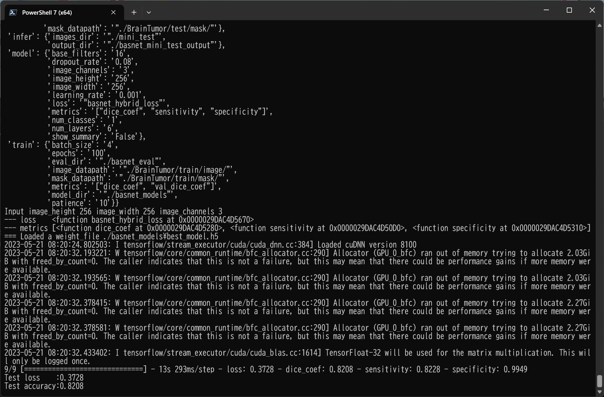 
 

<h2>
8 Inference by TensorflowUNet Model with basnet_hybrid_loss
</h2>
We have also tried to infer the segmented region for <b>mini_test</b> dataset, which is the same mini_test dataset used in the case of <b>basnet_hybrid_loss=False</b>. 
Please run the following bat file. 
<pre>
>6.infer.bat
</pre>
, which simply runs the following command. 
<pre> 
python ./TensorflowUNetBrainTumorInfer.py ./train_eval_infer_basnet_hybrid_loss.config
</pre>

<b>Input images (mini_test) </b> 
 
 
<b>Infered images (mini_test_output_basnet_hybrid_loss)</b> 
Some green tumor regions in the original images of the mini_test dataset above have been detected as shown below.
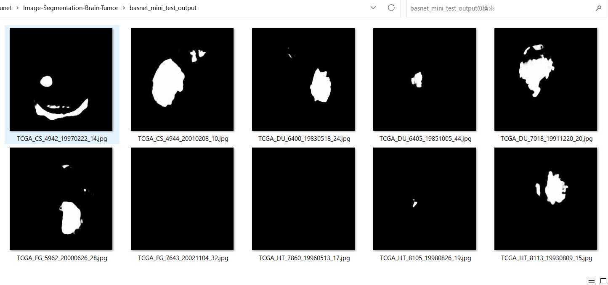  

<h3>
References
</h3>
<b>1. Brain MRI segmentation</b> 
<pre>
https://www.kaggle.com/datasets/mateuszbuda/lgg-mri-segmentation
</pre>
<b>2. Brain tumor segmentation based on deep learning and an attention mechanism using MRI multi-modalities brain images</b> 
Ramin Ranjbarzadeh, Abbas Bagherian Kasgari, Saeid Jafarzadeh Ghoushchi,  
Shokofeh Anari, Maryam Naseri & Malika Bendechache  
<pre>
https://www.nature.com/articles/s41598-021-90428-8
</pre>
<b>3. Deep learning based brain tumor segmentation: a survey</b> 
Zhihua Liu, Lei Tong, Long Chen, Zheheng Jiang, Feixiang Zhou, 
Qianni Zhang, Xiangrong Zhang, Yaochu Jin & Huiyu Zhou
 
<pre>
https://link.springer.com/article/10.1007/s40747-022-00815-5
</pre>

<b>4. Semantic-Segmentation-Loss-Functions (SemSegLoss)</b> 
<pre>
https://github.com/shruti-jadon/Semantic-Segmentation-Loss-Functions
</pre>
<pre>
Citation
@inproceedings{jadon2020survey,
  title={A survey of loss functions for semantic segmentation},
  author={Jadon, Shruti},
  booktitle={2020 IEEE Conference on Computational Intelligence in Bioinformatics and Computational Biology (CIBCB)},
  pages={1--7},
  year={2020},
  organization={IEEE}
}
@article{JADON2021100078,
title = {SemSegLoss: A python package of loss functions for semantic segmentation},
journal = {Software Impacts},
volume = {9},
pages = {100078},
year = {2021},
issn = {2665-9638},
doi = {https://doi.org/10.1016/j.simpa.2021.100078},
url = {https://www.sciencedirect.com/science/article/pii/S2665963821000269},
author = {Shruti Jadon},
keywords = {Deep Learning, Image segmentation, Medical imaging, Loss functions},
abstract = {Image Segmentation has been an active field of research as it has a wide range of applications, 
ranging from automated disease detection to self-driving cars. In recent years, various research papers 
proposed different loss functions used in case of biased data, sparse segmentation, and unbalanced dataset. 
In this paper, we introduce SemSegLoss, a python package consisting of some of the well-known loss functions 
widely used for image segmentation. It is developed with the intent to help researchers in the development 
of novel loss functions and perform an extensive set of experiments on model architectures for various 
applications. The ease-of-use and flexibility of the presented package have allowed reducing the development 
time and increased evaluation strategies of machine learning models for semantic segmentation. Furthermore, 
different applications that use image segmentation can use SemSegLoss because of the generality of its 
functions. This wide range of applications will lead to the development and growth of AI across all industries.
}
}
</pre>
 

<h2>
Appendix
</h2>
<h3>Model summary</h3>
Please run the following command to see the summary of TensorflowUNet Model
defined by <b>train_eval_infer.config</b>.  
<pre>
>python TensorflowUNet.py
</pre>
<a href="./asset/model.png">Model Visualization</a>
<pre>
__________________________________________________________________________________________________
 Layer (type)                   Output Shape         Param #     Connected to
==================================================================================================
 input_1 (InputLayer)           [(None, 256, 256, 3  0           []
                                )]

 lambda (Lambda)                (None, 256, 256, 3)  0           ['input_1[0][0]']

 conv2d (Conv2D)                (None, 256, 256, 16  448         ['lambda[0][0]']
                                )

 dropout (Dropout)              (None, 256, 256, 16  0           ['conv2d[0][0]']
                                )

 conv2d_1 (Conv2D)              (None, 256, 256, 16  2320        ['dropout[0][0]']
                                )

 max_pooling2d (MaxPooling2D)   (None, 128, 128, 16  0           ['conv2d_1[0][0]']
                                )

 conv2d_2 (Conv2D)              (None, 128, 128, 32  4640        ['max_pooling2d[0][0]']
                                )

 dropout_1 (Dropout)            (None, 128, 128, 32  0           ['conv2d_2[0][0]']
                                )

 conv2d_3 (Conv2D)              (None, 128, 128, 32  9248        ['dropout_1[0][0]']
                                )

 max_pooling2d_1 (MaxPooling2D)  (None, 64, 64, 32)  0           ['conv2d_3[0][0]']

 conv2d_4 (Conv2D)              (None, 64, 64, 64)   18496       ['max_pooling2d_1[0][0]']

 dropout_2 (Dropout)            (None, 64, 64, 64)   0           ['conv2d_4[0][0]']

 conv2d_5 (Conv2D)              (None, 64, 64, 64)   36928       ['dropout_2[0][0]']

 max_pooling2d_2 (MaxPooling2D)  (None, 32, 32, 64)  0           ['conv2d_5[0][0]']

 conv2d_6 (Conv2D)              (None, 32, 32, 128)  73856       ['max_pooling2d_2[0][0]']

 dropout_3 (Dropout)            (None, 32, 32, 128)  0           ['conv2d_6[0][0]']

 conv2d_7 (Conv2D)              (None, 32, 32, 128)  147584      ['dropout_3[0][0]']

 max_pooling2d_3 (MaxPooling2D)  (None, 16, 16, 128)  0          ['conv2d_7[0][0]']

 conv2d_8 (Conv2D)              (None, 16, 16, 256)  295168      ['max_pooling2d_3[0][0]']

 dropout_4 (Dropout)            (None, 16, 16, 256)  0           ['conv2d_8[0][0]']

 conv2d_9 (Conv2D)              (None, 16, 16, 256)  590080      ['dropout_4[0][0]']

 max_pooling2d_4 (MaxPooling2D)  (None, 8, 8, 256)   0           ['conv2d_9[0][0]']

 conv2d_10 (Conv2D)             (None, 8, 8, 512)    1180160     ['max_pooling2d_4[0][0]']

 dropout_5 (Dropout)            (None, 8, 8, 512)    0           ['conv2d_10[0][0]']

 conv2d_11 (Conv2D)             (None, 8, 8, 512)    2359808     ['dropout_5[0][0]']

 max_pooling2d_5 (MaxPooling2D)  (None, 4, 4, 512)   0           ['conv2d_11[0][0]']

 conv2d_12 (Conv2D)             (None, 4, 4, 1024)   4719616     ['max_pooling2d_5[0][0]']

 dropout_6 (Dropout)            (None, 4, 4, 1024)   0           ['conv2d_12[0][0]']

 conv2d_13 (Conv2D)             (None, 4, 4, 1024)   9438208     ['dropout_6[0][0]']

 conv2d_transpose (Conv2DTransp  (None, 8, 8, 512)   2097664     ['conv2d_13[0][0]']
 ose)

 concatenate (Concatenate)      (None, 8, 8, 1024)   0           ['conv2d_transpose[0][0]',
                                                                  'conv2d_11[0][0]']

 conv2d_14 (Conv2D)             (None, 8, 8, 512)    4719104     ['concatenate[0][0]']

 dropout_7 (Dropout)            (None, 8, 8, 512)    0           ['conv2d_14[0][0]']

 conv2d_15 (Conv2D)             (None, 8, 8, 512)    2359808     ['dropout_7[0][0]']

 conv2d_transpose_1 (Conv2DTran  (None, 16, 16, 256)  524544     ['conv2d_15[0][0]']
 spose)

 concatenate_1 (Concatenate)    (None, 16, 16, 512)  0           ['conv2d_transpose_1[0][0]',
                                                                  'conv2d_9[0][0]']

 conv2d_16 (Conv2D)             (None, 16, 16, 256)  1179904     ['concatenate_1[0][0]']

 dropout_8 (Dropout)            (None, 16, 16, 256)  0           ['conv2d_16[0][0]']

 conv2d_17 (Conv2D)             (None, 16, 16, 256)  590080      ['dropout_8[0][0]']

 conv2d_transpose_2 (Conv2DTran  (None, 32, 32, 128)  131200     ['conv2d_17[0][0]']
 spose)

 concatenate_2 (Concatenate)    (None, 32, 32, 256)  0           ['conv2d_transpose_2[0][0]',
                                                                  'conv2d_7[0][0]']

 conv2d_18 (Conv2D)             (None, 32, 32, 128)  295040      ['concatenate_2[0][0]']

 dropout_9 (Dropout)            (None, 32, 32, 128)  0           ['conv2d_18[0][0]']

 conv2d_19 (Conv2D)             (None, 32, 32, 128)  147584      ['dropout_9[0][0]']

 conv2d_transpose_3 (Conv2DTran  (None, 64, 64, 64)  32832       ['conv2d_19[0][0]']
 spose)

 concatenate_3 (Concatenate)    (None, 64, 64, 128)  0           ['conv2d_transpose_3[0][0]',
                                                                  'conv2d_5[0][0]']

 conv2d_20 (Conv2D)             (None, 64, 64, 64)   73792       ['concatenate_3[0][0]']

 dropout_10 (Dropout)           (None, 64, 64, 64)   0           ['conv2d_20[0][0]']

 conv2d_21 (Conv2D)             (None, 64, 64, 64)   36928       ['dropout_10[0][0]']

 conv2d_transpose_4 (Conv2DTran  (None, 128, 128, 32  8224       ['conv2d_21[0][0]']
 spose)                         )

 concatenate_4 (Concatenate)    (None, 128, 128, 64  0           ['conv2d_transpose_4[0][0]',
                                )                                 'conv2d_3[0][0]']

 conv2d_22 (Conv2D)             (None, 128, 128, 32  18464       ['concatenate_4[0][0]']
                                )

 dropout_11 (Dropout)           (None, 128, 128, 32  0           ['conv2d_22[0][0]']
                                )

 conv2d_23 (Conv2D)             (None, 128, 128, 32  9248        ['dropout_11[0][0]']
                                )

 conv2d_transpose_5 (Conv2DTran  (None, 256, 256, 16  2064       ['conv2d_23[0][0]']
 spose)                         )

 concatenate_5 (Concatenate)    (None, 256, 256, 32  0           ['conv2d_transpose_5[0][0]',
                                )                                 'conv2d_1[0][0]']

 conv2d_24 (Conv2D)             (None, 256, 256, 16  4624        ['concatenate_5[0][0]']
                                )

 dropout_12 (Dropout)           (None, 256, 256, 16  0           ['conv2d_24[0][0]']
                                )

 conv2d_25 (Conv2D)             (None, 256, 256, 16  2320        ['dropout_12[0][0]']
                                )

 conv2d_26 (Conv2D)             (None, 256, 256, 1)  17          ['conv2d_25[0][0]']

==================================================================================================
</pre>

