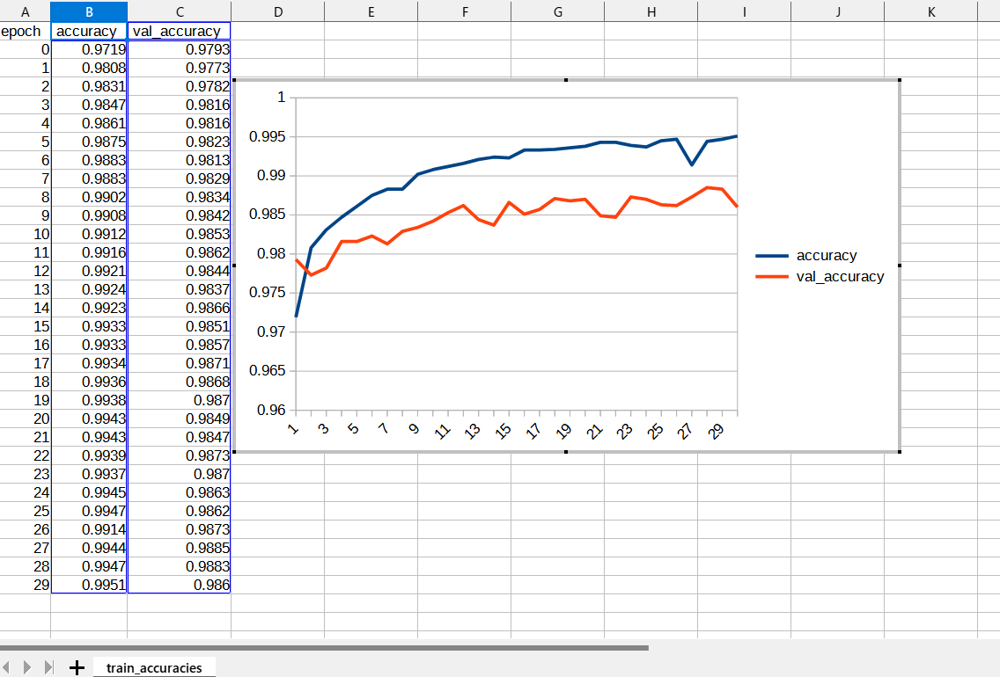
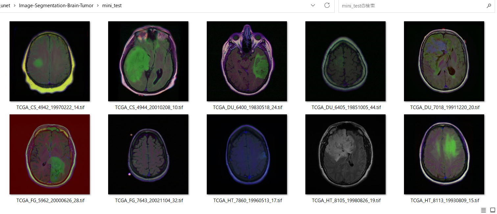
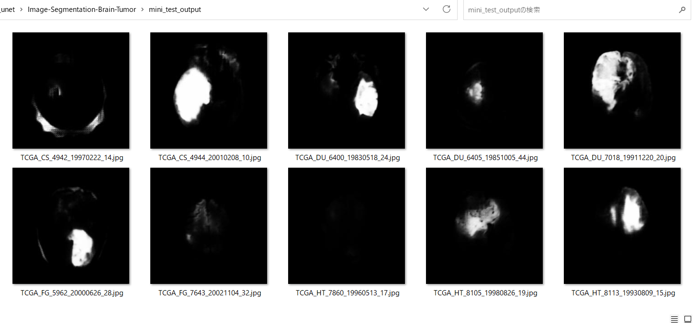

# Image-Segmentation-Brain-Tumor (Updated: 2023/05/12)
<h2>
1 Image-Segmentation-Brain-Tumor
</h2>

This is an experimental project for Image-Segmentation of Brain-Tumor by using
our <a href="https://github.com/atlan-antillia/Tensorflow-Slightly-Flexible-UNet">Tensorflow-Slightly-Flexible-UNet</a> Model.
 

The image dataset used here has been taken from the following web site.

<pre>
Brain MRI segmentation
https://www.kaggle.com/datasets/mateuszbuda/lgg-mri-segmentation
</pre>

About Dataset 
LGG Segmentation Dataset 
Dataset used in: 

Mateusz Buda, AshirbaniSaha, Maciej A. Mazurowski "Association of genomic subtypes of 
lower-grade gliomas with shape features automatically extracted by a deep learning 
algorithm." Computers in Biology and Medicine, 2019.
and
Maciej A. Mazurowski, Kal Clark, Nicholas M. Czarnek, Parisa Shamsesfandabadi, 
Katherine B. Peters, Ashirbani Saha "Radiogenomics of lower-grade glioma: 
algorithmically-assessed tumor shape is associated with tumor genomic subtypes 
and patient outcomes in a multi-institutional study with 
The Cancer Genome Atlas data." Journal of Neuro-Oncology, 2017.

This dataset contains brain MR images together with manual FLAIR abnormality 
segmentation masks.
The images were obtained from The Cancer Imaging Archive (TCIA).
They correspond to 110 patients included in The Cancer Genome Atlas (TCGA) 
lower-grade glioma collection with at least fluid-attenuated inversion recovery (FLAIR) 
sequence and genomic cluster data available.
Tumor genomic clusters and patient data is provided in data.csv file.

See also:

<pre>
U-Net: Convolutional Networks for Biomedical Image Segmentation
 https://arxiv.org/pdf/1505.04597.pdf
</pre>
<ul>
    <li>2023/05/12: Modified TensorflowUNetModel to be compiled with dice_loss function. </li>
    <li>2023/05/12: Trained, evaluated and inferred Brain-Tumor-TensorflowUNet-Model with dice_loss. </li>

</ul>

 
<h2>
2 Prepare dataset
</h2>

<h3>
2.1 Download master dataset
</h3>
 Please download the original dataset from the following link 
<pre>
https://www.kaggle.com/datasets/mateuszbuda/lgg-mri-segmentation
</pre>
<b>lgg-mri-segmentation</b> dataset has the following folder structure. 
<pre>
lgg-mri-segmentation
└─kaggle_3m
    ├─TCGA_CS_4941_19960909
    ├─TCGA_CS_4942_19970222
    ├─TCGA_CS_4943_20000902
    ├─TCGA_CS_4944_20010208
    ├─TCGA_CS_5393_19990606
     ...
    ├─TCGA_HT_A5RC_19990831
    ├─TCGA_HT_A616_19991226
    ├─TCGA_HT_A61A_20000127
    └─TCGA_HT_A61B_19991127
</pre>
For example,TCGA_CS_4941_19960909 folder contains the MRI image files and corressponding mask files
as show below. 
 

<h3>
2.2 Split master dataset
</h3>
We have split Brain-Tumor dataset to <b>train</b> and <b>test</b> dataset 
by using Python <a href="./split_master.py">split_master.py</a> script.
<pre>
BrainTumor
├─test
│  ├─image
│  └─mask
└─train
    ├─image
    └─mask
</pre>

<h2>
3 Train TensorflowUNet Model
</h2>
 We have trained Brain-Tumor TensorflowUNet Model by using the following
 <b>train_eval_infer.config</b> file.  
Please run the following command. 
<pre>
>python TensorflowUNetBrainTumorTrainer.py
</pre>

<pre>
; train_eval_infer.config
; 2023/5/11 antillia.com
; Added dice_loss
[model]
image_width    = 256
image_height   = 256
image_channels = 3
num_classes    = 1
base_filters   = 16
num_layers     = 6
dropout_rate   = 0.08
learning_rate  = 0.001
dice_loss      = False
show_summary   = False

[train]
epochs        = 100
batch_size    = 4
patience      = 10
model_dir     = "./models"
eval_dir      = "./eval"

image_datapath = "./BrainTumor/train/image/"
mask_datapath  = "./BrainTumor/train/mask/"

[eval]
image_datapath = "./BrainTumor/test/image/"
mask_datapath  = "./BrainTumor/test/mask/"

[infer] 
images_dir    = "./mini_test" 
output_dir    = "./mini_test_output"
</pre>
We have also used Python <a href="./BrainTumorDataset.py">BrainTumorDataset.py</a> script to create
train and test dataset from the original and segmented images specified by
<b>image_datapath</b> and <b>mask_datapath </b> parameters in the configratration file. 
The training process has just been stopped at epoch 30 by an early-stopping callback as shown below.  
 
 
Since <b>dice_loss</b> is set to be <b>False</b> in <b>train_eval_infer.config</b> file,
<b>binary_crossentropy</b> is used as a loss function to compile our model as shown below.
<pre>
  self.loss    = "binary_crossentropy"
  self.metrics = ["accuracy"]
  self.model.compile(optimizer = self.optimizer, loss= self.loss, metrics = self.metrics)
</pre>
The <b>val_accuracy</b> is very high as shown below from the beginning of the training. 
<b>Train accuracies line graph</b>: 
 

 
The val_loss is also very low as shown below from the beginning of the training. 
<b>Train losses line graph</b>: 
 

<h2>
4 Evaluation
</h2>
 We have evaluated prediction accuracy of our Pretrained Brain-Tumor Model by using <b>test</b> dataset.

Please run the Python script <a href="./TensorflowUNetBrainTumorEvaluator.py">TensorflowUNetBrainTumorEvaluator.py</a> 
in the following way. 
<pre>
>python TensorflowUNetBrainTumorEvaluator.py
</pre>
The evaluation result of this time is the following. 
 
 

<h2>
5 Inference 
</h2>
We have also tried to infer the segmented region for <b>mini_test</b> dataset, which is a very small dataset including only ten images extracted from <b>test</b> dataset,
 by using our Pretrained Brain-Tumor Model. 
Please run the following command for Python script <a href="./TensorflowUNetBrainTumorInfer.py">TensorflowUNetBrainTumorInfer.py</a>. 
<pre>
>python TensorflowUNetBrainTumorInfer.py
</pre>

<b>Input images (mini_test) </b> 
 
 
<b>Infered images (mini_test_output)</b> 
Some green tumor regions in the original images of the mini_test dataset above have been detected as shown below.
  

 
<!--
-->

<h2>
6 Train TensorflowUNet Model with dice_loss
</h2>
 We have trained Brain-Tumor TensorflowUNet Model by using the following
 <b>train_eval_infer_dice_loss.config</b> file.  
Please run the following bat file. 
<pre>
>4.train.bat
</pre>
, which simply runs the following command. 
<pre> 
python ./TensorflowUNetBrainTumorTrainer.py ./train_eval_infer_dice_loss.config
</pre>
<pre>
; train_eval_infer_dice_losss.config
; 2023/5/12 antillia.com

[model]
image_width    = 256
image_height   = 256
image_channels = 3
num_classes    = 1
base_filters   = 16
num_layers     = 6
dropout_rate   = 0.08
dice_loss      = True
learning_rate  = 0.001
show_summary   = False

[train]
epochs        = 100
batch_size    = 4
patience      = 10
metrics       = ["dice_coef", "val_dice_coef"]
model_dir     = "./dice_loss_models"
eval_dir      = "./dice_loss_eval"

image_datapath = "./BrainTumor/train/image/"
mask_datapath  = "./BrainTumor/train/mask/"

[eval]
image_datapath = "./BrainTumor/test/image/"
mask_datapath  = "./BrainTumor/test/mask/"

[infer] 
images_dir    = "./mini_test" 
output_dir    = "./mini_test_output_dice_loss"

</pre>
The training process has just been stopped at epoch 41 by an early-stopping callback as shown below.  
 
 
Since <b>dice_loss</b> is set to be <b>True</b> in <b>train_eval_infer_dice_loss.config</b> file,
the following loss and metrics are used to compile our model as shown below.
<pre>
  self.loss    = basnet_hybrid_loss
  self.metrics = [dice_coef, sensitivity, specificity]
  self.model.compile(optimizer = self.optimizer, loss= self.loss, metrics = self.metrics)
</pre>

<b>Train metrics(dice_coef) line graph</b>: 
 

 
<b>Train losses line graph</b>: 
 

<h2>
7 Evaluation by TensorflowUNet Model with dice_loss
</h2>
 We have evaluated prediction accuracy of our Pretrained Brain-Tumor Model by using <b>test</b> dataset. 
Please run the following bat file. 
<pre>
>5.train.bat
</pre>
, which simply runs the following command. 
<pre> 
python ./TensorflowUNetBrainTumorEvaluator.py ./train_eval_infer_dice_loss.config
</pre>
The evaluation result of this time is the following. 
 
 

<h2>
8 Inference by TensorflowUNet Model with dice_loss
</h2>
We have also tried to infer the segmented region for <b>mini_test</b> dataset, which is the same mini_test dataset used in the case of <b>dice_loss=False</b>. 
Please run the following bat file. 
<pre>
>6.infer.bat
</pre>
, which simply runs the following command. 
<pre> 
python ./TensorflowUNetBrainTumorInfer.py ./train_eval_infer_dice_loss.config
</pre>

<b>Input images (mini_test) </b> 
 
 
<b>Infered images (mini_test_output_dice_loss)</b> 
Some green tumor regions in the original images of the mini_test dataset above have been detected as shown below.
  

<h3>
References
</h3>
<b>1. Brain MRI segmentation</b> 
<pre>
https://www.kaggle.com/datasets/mateuszbuda/lgg-mri-segmentation
</pre>
<b>2. Brain tumor segmentation based on deep learning and an attention mechanism using MRI multi-modalities brain images</b> 
Ramin Ranjbarzadeh, Abbas Bagherian Kasgari, Saeid Jafarzadeh Ghoushchi,  
Shokofeh Anari, Maryam Naseri & Malika Bendechache  
<pre>
https://www.nature.com/articles/s41598-021-90428-8
</pre>
<b>3. Deep learning based brain tumor segmentation: a survey</b> 
Zhihua Liu, Lei Tong, Long Chen, Zheheng Jiang, Feixiang Zhou, 
Qianni Zhang, Xiangrong Zhang, Yaochu Jin & Huiyu Zhou
 
<pre>
https://link.springer.com/article/10.1007/s40747-022-00815-5
</pre>

<h2>
Appendix
</h2>
<h3>Model summary</h3>
Please run the following command to see the summary of TensorflowUNet Model
defined by <b>train_eval_infer.config</b>.  
<pre>
>python TensorflowUNet.py
</pre>
<a href="./asset/model.png">Model Visualization</a>
<pre>
__________________________________________________________________________________________________
 Layer (type)                   Output Shape         Param #     Connected to
==================================================================================================
 input_1 (InputLayer)           [(None, 256, 256, 3  0           []
                                )]

 lambda (Lambda)                (None, 256, 256, 3)  0           ['input_1[0][0]']

 conv2d (Conv2D)                (None, 256, 256, 16  448         ['lambda[0][0]']
                                )

 dropout (Dropout)              (None, 256, 256, 16  0           ['conv2d[0][0]']
                                )

 conv2d_1 (Conv2D)              (None, 256, 256, 16  2320        ['dropout[0][0]']
                                )

 max_pooling2d (MaxPooling2D)   (None, 128, 128, 16  0           ['conv2d_1[0][0]']
                                )

 conv2d_2 (Conv2D)              (None, 128, 128, 32  4640        ['max_pooling2d[0][0]']
                                )

 dropout_1 (Dropout)            (None, 128, 128, 32  0           ['conv2d_2[0][0]']
                                )

 conv2d_3 (Conv2D)              (None, 128, 128, 32  9248        ['dropout_1[0][0]']
                                )

 max_pooling2d_1 (MaxPooling2D)  (None, 64, 64, 32)  0           ['conv2d_3[0][0]']

 conv2d_4 (Conv2D)              (None, 64, 64, 64)   18496       ['max_pooling2d_1[0][0]']

 dropout_2 (Dropout)            (None, 64, 64, 64)   0           ['conv2d_4[0][0]']

 conv2d_5 (Conv2D)              (None, 64, 64, 64)   36928       ['dropout_2[0][0]']

 max_pooling2d_2 (MaxPooling2D)  (None, 32, 32, 64)  0           ['conv2d_5[0][0]']

 conv2d_6 (Conv2D)              (None, 32, 32, 128)  73856       ['max_pooling2d_2[0][0]']

 dropout_3 (Dropout)            (None, 32, 32, 128)  0           ['conv2d_6[0][0]']

 conv2d_7 (Conv2D)              (None, 32, 32, 128)  147584      ['dropout_3[0][0]']

 max_pooling2d_3 (MaxPooling2D)  (None, 16, 16, 128)  0          ['conv2d_7[0][0]']

 conv2d_8 (Conv2D)              (None, 16, 16, 256)  295168      ['max_pooling2d_3[0][0]']

 dropout_4 (Dropout)            (None, 16, 16, 256)  0           ['conv2d_8[0][0]']

 conv2d_9 (Conv2D)              (None, 16, 16, 256)  590080      ['dropout_4[0][0]']

 max_pooling2d_4 (MaxPooling2D)  (None, 8, 8, 256)   0           ['conv2d_9[0][0]']

 conv2d_10 (Conv2D)             (None, 8, 8, 512)    1180160     ['max_pooling2d_4[0][0]']

 dropout_5 (Dropout)            (None, 8, 8, 512)    0           ['conv2d_10[0][0]']

 conv2d_11 (Conv2D)             (None, 8, 8, 512)    2359808     ['dropout_5[0][0]']

 max_pooling2d_5 (MaxPooling2D)  (None, 4, 4, 512)   0           ['conv2d_11[0][0]']

 conv2d_12 (Conv2D)             (None, 4, 4, 1024)   4719616     ['max_pooling2d_5[0][0]']

 dropout_6 (Dropout)            (None, 4, 4, 1024)   0           ['conv2d_12[0][0]']

 conv2d_13 (Conv2D)             (None, 4, 4, 1024)   9438208     ['dropout_6[0][0]']

 conv2d_transpose (Conv2DTransp  (None, 8, 8, 512)   2097664     ['conv2d_13[0][0]']
 ose)

 concatenate (Concatenate)      (None, 8, 8, 1024)   0           ['conv2d_transpose[0][0]',
                                                                  'conv2d_11[0][0]']

 conv2d_14 (Conv2D)             (None, 8, 8, 512)    4719104     ['concatenate[0][0]']

 dropout_7 (Dropout)            (None, 8, 8, 512)    0           ['conv2d_14[0][0]']

 conv2d_15 (Conv2D)             (None, 8, 8, 512)    2359808     ['dropout_7[0][0]']

 conv2d_transpose_1 (Conv2DTran  (None, 16, 16, 256)  524544     ['conv2d_15[0][0]']
 spose)

 concatenate_1 (Concatenate)    (None, 16, 16, 512)  0           ['conv2d_transpose_1[0][0]',
                                                                  'conv2d_9[0][0]']

 conv2d_16 (Conv2D)             (None, 16, 16, 256)  1179904     ['concatenate_1[0][0]']

 dropout_8 (Dropout)            (None, 16, 16, 256)  0           ['conv2d_16[0][0]']

 conv2d_17 (Conv2D)             (None, 16, 16, 256)  590080      ['dropout_8[0][0]']

 conv2d_transpose_2 (Conv2DTran  (None, 32, 32, 128)  131200     ['conv2d_17[0][0]']
 spose)

 concatenate_2 (Concatenate)    (None, 32, 32, 256)  0           ['conv2d_transpose_2[0][0]',
                                                                  'conv2d_7[0][0]']

 conv2d_18 (Conv2D)             (None, 32, 32, 128)  295040      ['concatenate_2[0][0]']

 dropout_9 (Dropout)            (None, 32, 32, 128)  0           ['conv2d_18[0][0]']

 conv2d_19 (Conv2D)             (None, 32, 32, 128)  147584      ['dropout_9[0][0]']

 conv2d_transpose_3 (Conv2DTran  (None, 64, 64, 64)  32832       ['conv2d_19[0][0]']
 spose)

 concatenate_3 (Concatenate)    (None, 64, 64, 128)  0           ['conv2d_transpose_3[0][0]',
                                                                  'conv2d_5[0][0]']

 conv2d_20 (Conv2D)             (None, 64, 64, 64)   73792       ['concatenate_3[0][0]']

 dropout_10 (Dropout)           (None, 64, 64, 64)   0           ['conv2d_20[0][0]']

 conv2d_21 (Conv2D)             (None, 64, 64, 64)   36928       ['dropout_10[0][0]']

 conv2d_transpose_4 (Conv2DTran  (None, 128, 128, 32  8224       ['conv2d_21[0][0]']
 spose)                         )

 concatenate_4 (Concatenate)    (None, 128, 128, 64  0           ['conv2d_transpose_4[0][0]',
                                )                                 'conv2d_3[0][0]']

 conv2d_22 (Conv2D)             (None, 128, 128, 32  18464       ['concatenate_4[0][0]']
                                )

 dropout_11 (Dropout)           (None, 128, 128, 32  0           ['conv2d_22[0][0]']
                                )

 conv2d_23 (Conv2D)             (None, 128, 128, 32  9248        ['dropout_11[0][0]']
                                )

 conv2d_transpose_5 (Conv2DTran  (None, 256, 256, 16  2064       ['conv2d_23[0][0]']
 spose)                         )

 concatenate_5 (Concatenate)    (None, 256, 256, 32  0           ['conv2d_transpose_5[0][0]',
                                )                                 'conv2d_1[0][0]']

 conv2d_24 (Conv2D)             (None, 256, 256, 16  4624        ['concatenate_5[0][0]']
                                )

 dropout_12 (Dropout)           (None, 256, 256, 16  0           ['conv2d_24[0][0]']
                                )

 conv2d_25 (Conv2D)             (None, 256, 256, 16  2320        ['dropout_12[0][0]']
                                )

 conv2d_26 (Conv2D)             (None, 256, 256, 1)  17          ['conv2d_25[0][0]']

==================================================================================================
</pre>

